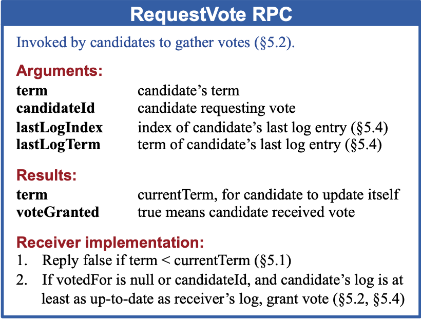
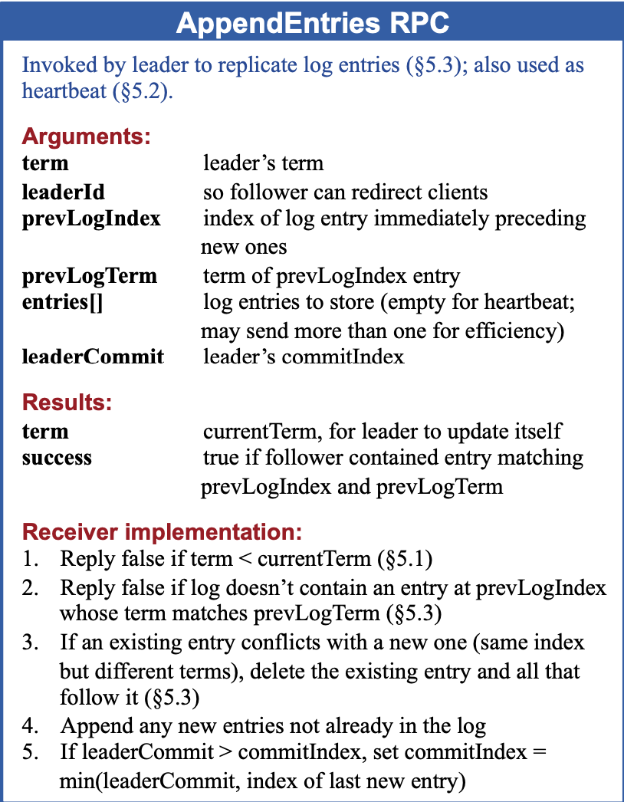

### 0 前言

raft算法是现在在**分布式系统**中广泛应用的一种**共识性算法**，网上可以找到许多介绍文章，但是却往往通篇都是进行了介绍，未能明确梳理逻辑，本文旨在自顶向下逐步拆解问题，清晰解释raft算法的主线。

### 1 raft算法的来源（拜占庭将军问题）

> 曾经的拜占庭国土辽阔，为了抵御来自各个方向的敌人，军队之间分隔很远，他们之间只能通过信使互相传递消息。一场新的战役即将爆发，有5支拜占庭军队要共同进退，5个将军都是平级的，他们要怎么达成一起进攻或者一起撤退的共识呢？
>
> 最简单的办法就是投票，每个将军都派出信使将自己的意见发给其他四个将军。对每个将军来说，算上自己的票数，如果进攻票超过2票就会发起进攻，如果少于或者等于2票就撤退。这是最简单的情况，很合逻辑。那假如是下面的情况呢？
>
> 1. 5个将军中有一个是奸细，其他4个将军有两个赞成进攻，2个反对，这个将军给其中2个发去了进攻的意见，给另外2个却是撤退，结果是2支军队进攻，2支军队撤退，没有达成共识。
> 2. 可能有一个或者多个信使被暗杀，或者被策反。
>
> 在这两种情况下，投票的结果不能代表大多数将军的意见。

以上问题为拜占庭问题，总结一下就是如何在可能有叛徒的情况下，得出一致的结论。而这个问题的模型映射到计算机中，也就是如何解决分布式系统的一致性问题。

2013年图灵奖得主 Leslie Lamport 在 1980 年的论文 《The Byzantine Generals Problem》 中回答了这个问题是否有解，以及有解的话需要满足什么样的条件，之后在1990年在特定前提条件的基础上，提出了一种解法，也就是共识算法Paxos。

虽然这个解法解决了问题，但是却因为**过于复杂**，**难以用于教学以及在实际应用中使用**，并且在日常工作中分布式系统面对的问题更多是故障引起，不需要考虑恶意信息，可以认为所有的节点都是可信的，所以可以进行大幅简化，因此raft共识算法诞生了。

### 2 raft算法概述

raft一致性算法关键点在于选出一个leader。leader负责接受来自所有客户端的请求，管理所有节点的日志，保证分布式系统的一致性。

基于这一点就可以将问题**分解成3个独立的子问题**：

（1）Leader election：如何选取leader

（2）Log replication：日志如何正确复制同步

（3）Safety：安全性，即如何保证所有节点应用相同的日志

### 3 raft基础知识

在分别解决三个子问题之前先简单介绍一下Raft算法所需的基础知识

#### 3.1 States（三种角色状态）

- Leader（只有一个）：接受所有客户端请求，负责同步所有其他节点

- Follower：只能被动接收leader的同步请求

- Candidate：当Follower一段时间无法监测到Leader的心跳后，转变为Candidate向其他所有节点发起投票，请求投票给自己

#### 3.2 Term（任期）

raft将时间分割成多个term，每一个term开始都进行一次新的选举，term值单调递增。如果没有成功选举出leader（如t3），则快速进入下一个term。

#### 3.3 两种RPC

Raft的各节点通过RPC进行通信，为了实现所需功能，需要2种RPC

RequestVote RPC（由candidate发出）：用于**请求获取投票**使用，包含当前候选人的信息

AppendEntries RPC（由leader发出）：当参数entries数组为空时，充当**心跳RPC**，定期由leader向所有其他节点发送。当参数entries数组有内容时，充当**同步RPC**，负责将客户端发送来的日志同步到所有节点。

PS：其实还有第三种RPC用于新增节点时使用，如果新增节点时，肯定不可能复制所有的日志后重头播放一遍所有的操作，因此该RPC的作用用于直接拷贝节点的镜像使用。

关于RPC携带详细参数的内容如下图所示，不看也无所谓，不影响全文逻辑。只是作为补充使用。

### 4 子问题一：Leader election

#### 4.1 选举流程

介绍完raft的基本构成之后就可以开始逐个分析靠leader控制实现一致性衍生的3个子问题了

首先就是如何选取leader节点

（1）leader会发送**周期性心跳RPC**（即AppendEntries RPC）给其他所有节点

（2）如果一个follower一段时间（election time）没有接受到心跳，则转变为candidate，自身的term加一，开始重新竞选，投一票给自己后，向其他节点要票

PS：这里就产生了一个问题，如果每一个节点拥有相同的election time，则如果leader挂掉，就会全部同时变成candidate，然后投票给自己，因此就难以重新选出新leader，因此这里采用的算法是**randomized election timeout**，也就是每一个节点过期时间不同，在150～300ms这个范围，从而避免这个问题。（作者认为如果在这里引入权重的话会过于复杂，且效率低下）

（3）当一个candidate获得**超过二分之一**（>1/2）的票之后，便获胜变成leader

#### 4.2 投票规则

在这个问题中，涉及到的**投票规则**可以从不同身份的角度来看

首先是所有身份都有的行为：

（1）每个term每个节点只有一票，所以先来先得

（2）拒绝给term比自己小的节点投票

**follower：**

（1）只能给别人投票

（2）**拒绝给commited log 小于自身的candidate投票（也称Election restriction，这一点非常重要，正是解决了子问题3的关键，可以看完子问题三后回看这一点）**

**candidate：**

（1）自己会投自己一票

（2）如果其他求票candidate的term比自己大，则退回follower状态

（3）如果接收到了来自leader的心态，且leader的term >= 自己term，则退回follower

### 5 子问题二：Log replication

#### 5.1 日志同步流程

接着介绍一下raft算法中如何进行日志的同步

（1）leader接收所有client的请求（以及follower重定向给它的请求）

（2）通过AppendEntries RPC将日志复制给所有其他节点

（3）follower根据RPC中记录的leader的前一条log信息与当前自身最后一条log做比较，如果相同则加上这条日志返回成功，否则返回失败。（**consistency check**，如果返回失败的话校正方法在5.3中讲解）

（4）follower返回日志复制成功或失败

（5）当leader统计>1/2（包括自己） 的节点有该日志时，就commit这条日志

（6）在下一个心跳中通知其他节点commit这条日志

#### 5.2 Log Matching Property

每条日志都在log数组中有index和term两个属性，index就是这条日志在数组中的位置，term就是这条日志当时所处的term

raft的日志同步流程能够实现Log Matching Property，即如果两个节点的两条日志有相同的index和term，则这条日志以及之前所有的日志都是相同的。

这一点用数学归纳法很好证明。

1.初始的空状态是相同的

2.每次因为有consistency check保证前一条是日志是相同的才会加上新日志

#### 5.3 如何校准错误日志

在日志同步流程中，如果leader当选后收到日志后立刻挂掉等等情况可能会出现日志不一致的情况，在同步流程的第三步中consistency check会返回失败，这种情况leader会将日志往前回退一步后再次发送RPC，一直到follower遇到相同的日志返回成功为止。然后以leader的日志为准覆盖follower的日志。

### 6 子问题三：Safety

第三个子问题源于5.3中对不一致日志的校正，因为如果以leader的日志为基准，覆盖了follower已提交的日志的话，则会出现节点状态不一致，引发安全问题。

这一点怎么解决呢？

raft算法通过在选举leader时进行限制从而实现这一点，即在子问题一种投票规则中增加了Election restriction。

因此选出来的新leader一定是拥有所有commited log的信息的，也就不会出现回滚覆盖已提交的日志这种情况。

### 7 总结

因此可以看出，raft算法的核心在于对选取leader节点这一操作进行限制，从而大幅降低问题复杂度。相较于复杂的paxos算法，我们能够非常轻松的基于raft算法实现一致的分布式系统。